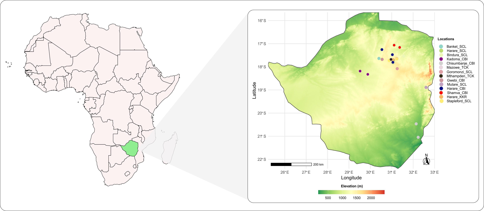

# Leveraging probabilistic models to enhance cultivar recommendation in Zimbabwe

**Authors:**  
José Tiago B. Chagas¹*, Mauricio S. Araújo¹, Marcela Martinez¹, João P. S. Pavan¹, Erica P. Leles², Michelle F. Santos², Brian W. Diers², Peter Goldsmith², Learnmore Mwadzingeni³, Ronica Mukaro⁴, Andrew Henderson⁵, Charles Mutimaamba⁶, Andrew Scaboo⁷, José Baldin Pinheiro¹*  

\*Corresponding authors: josetchagas@usp.br, jbaldin@usp.br  

---

### Dataset description

This repository contains the data and analysis scripts used in the study **“Leveraging probabilistic models to enhance cultivar recommendation in Zimbabwe.”** The dataset is part of the **Pan-African Soybean Trials Network**, aiming to identify superior soybean varieties across multiple environments and years using a **Bayesian Probabilistic Selection Index (BPSI)**.  

A total of **97 soybean varieties** were evaluated in **37 environments** over **six crop seasons in Zimbabwe**, with measurements for **grain yield, plant height,** and **lodging**. The Bayesian framework integrates the probability of superior performance within and across environments, providing a risk-aware approach to cultivar recommendation under heterogeneous conditions.

---

### Map of trial locations



---

### Abstract

Cultivar recommendation is a critical stage in plant breeding programs, and selecting superior varieties for multiple traits remains a challenge due to the variety × environment (V×E) interaction. The Pan-African Trials Network aims to expand soybean cultivar recommendations across new tropical and subtropical regions. However, varieties exhibit distinct adaptation patterns across environments. Bayesian probabilistic models offer a way to manage cultivar recommendation risk through the V×E interaction.

This study aimed to identify soybean varieties with high probabilities of superior performance across years and locations using a Bayesian Probabilistic Selection Index (BPSI) in a multi-trait and multi-environment framework. Ninety-seven soybean varieties were evaluated across 37 environments and six crop seasons in Zimbabwe using a randomized complete block design with three replications. Traits evaluated included grain yield, plant height, and lodging. The probability of superior performance was estimated using a 20% selection intensity for each trait and 10% for the multi-trait index. Plant height showed the highest experimental precision, whereas grain yield exhibited greater variability across environments. Most varieties performed better across groups of years than groups of locations, indicating stronger variety × location than variety × year interaction.

The BPSI identified ten varieties with high probabilities of superior performance across environments in Zimbabwe. Selected varieties achieved probabilities above 60% for grain yield, 80% for plant height, and 50% for lodging, indicating greater yield stability and reduced selection risk. By integrating the probability of superior performance within and across environments, the BPSI effectively identified varieties with both specific and broad adaptation. This Bayesian framework provides a robust, data-driven approach for cultivar recommendation in Zimbabwe, combining predictive accuracy and risk management.

---

### Repository structure

Zimbabwe_trials/
├─ BPSI/ # Core functions and scripts for Bayesian Probabilistic Selection Index
├─ Plots/ # Figures and visual outputs (includes Map.jpg)
├─ Presentation/ # Slides and visual materials
├─ Saves/ # Saved model objects, checkpoints, ppchecks
├─ across_probs/ # Probabilities across environments, years, and locations
├─ data/ # Raw and processed datasets
├─ misc/ # Auxiliary files (e.g., presentation notes)
├─ Zimbabwe_analysis.Rmd # Main analysis script (RMarkdown)
├─ Zimbabwe_analysis.html # Rendered report
├─ Zimbabwe_trials.Rproj # RStudio project file
└─ README.md # Project documentation

---
### Reproducibility

**Requirements:**
- R ≥ 4.3  
- Key packages: `tidyverse`, `data.table`, `ggplot2`, `rmarkdown`, `patchwork`,  
  `readr`, `readxl`, `here`, `janitor`, `brms` or `rstanarm`, `bayesplot`, `cowplot`

**To reproduce the analysis:**
```r
rmarkdown::render("Zimbabwe_analysis.Rmd", clean = TRUE)

---
### Reproducibility

**Requirements:**
- R ≥ 4.3  
- Key packages: `tidyverse`, `data.table`, `ggplot2`, `rmarkdown`, `patchwork`,  
  `readr`, `readxl`, `here`, `janitor`, `brms` or `rstanarm`, `bayesplot`, `cowplot`

**To reproduce the analysis:**
```r
rmarkdown::render("Zimbabwe_analysis.Rmd", clean = TRUE)
Outputs:
Figures → Plots/
Model results → Saves/

### Citation

Chagas JTB, Araújo MS, Martinez M, Pavan JPS, Leles EP, Santos MF, Diers BW, Goldsmith P, Mwadzingeni L, Mukaro R, Henderson A, Mutimaamba C, Scaboo A, Pinheiro JB. Leveraging probabilistic models to enhance cultivar recommendation in Zimbabwe. BMC Plant Biology, in review, 2025.

### License

MIT License © 2025 The Authors

### Contact

José Tiago B. Chagas — josetchagas@usp.br
José Baldin Pinheiro — jbaldin@usp.br

