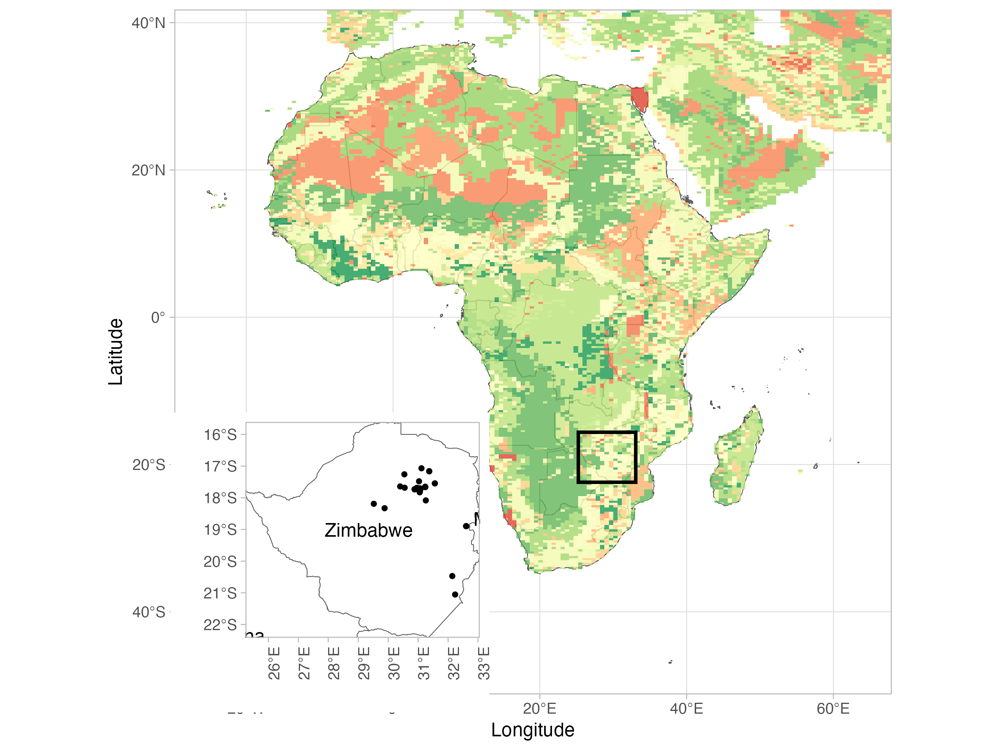
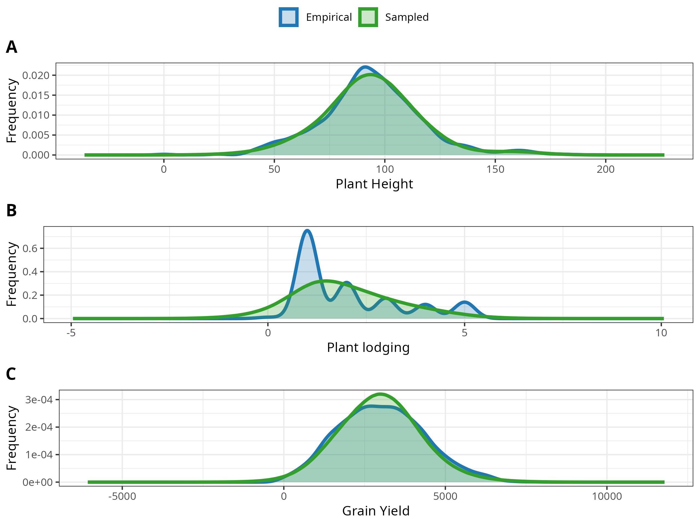
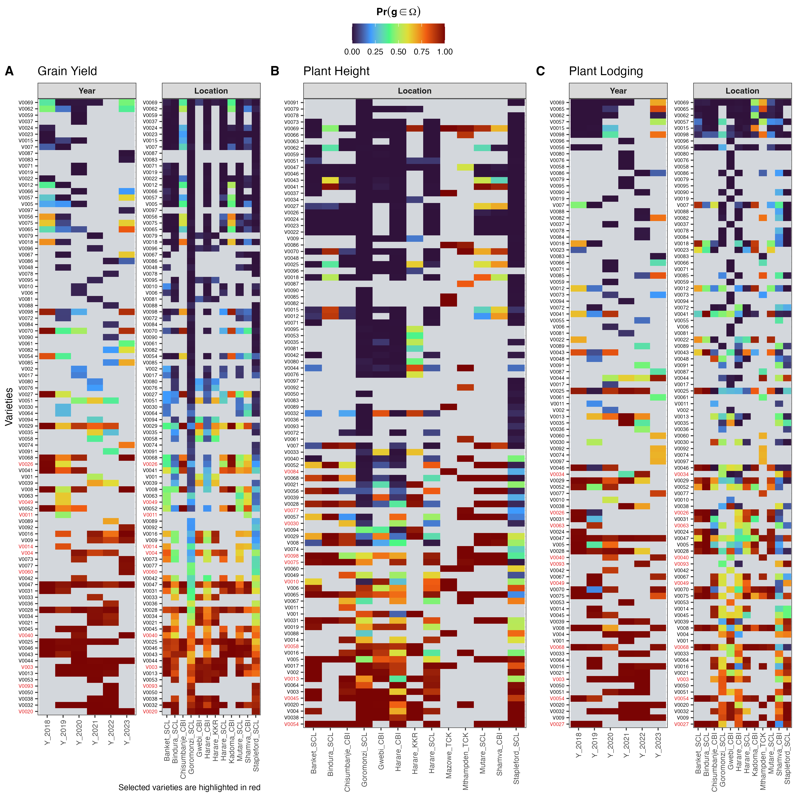
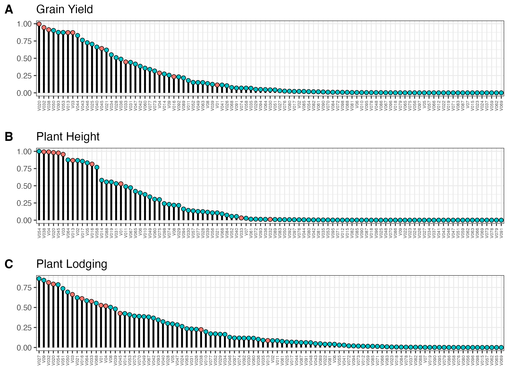
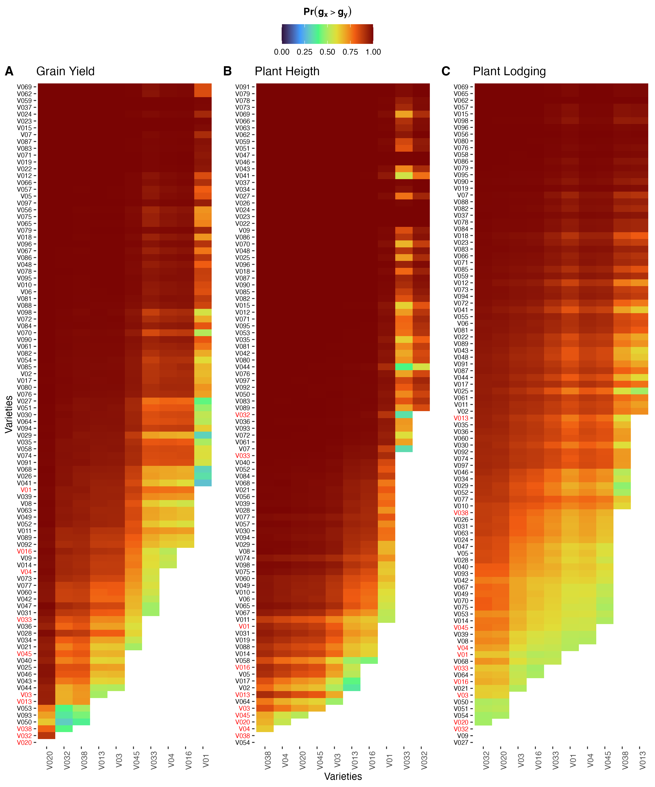

```{r setup, include=FALSE}
knitr::opts_chunk$set(echo = TRUE)
```

# Loading data
```{r}
#install.packages("ProbBreed")
#install.packages("sf")
#install.packages("stars")
library(tidyverse) 
data <- read.csv("data/Zimbabwe.csv",header = T,sep = ";")
# colnames(data)
# head(data)
pheno<- data[, c(4, 7, 16,21,25,27,38,41,46,63,64,65,66,68)] 
table(pheno$LOCATION_NAME)
colnames(pheno)
pheno$geno <- gsub(" ", "_",pheno$Crop_Variety)
pheno$geno <- factor(pheno$geno)
# unique(pheno$IRRIGATION)
levels(pheno$geno) <- paste("G", 1:length(levels(pheno$geno)), sep = "_")
# table(pheno$Crop_Variety)
# table(pheno$geno)

pheno[which(pheno$HARV_DATE==""),"LOCATION_NAME"]

pheno$DTH <- as.Date(as.character(pheno$HARV_DATE), format="%m/%d/%Y")-
                  as.Date(as.character(pheno$PLANT_DATE), format="%m/%d/%Y")-5
# dim(pheno)
# colnames(pheno)
# head(pheno)
# str(pheno)
pheno$GRAIN_YLD_13PCT <-  gsub(",", ".", pheno$GRAIN_YLD_13PCT)
trial <-  gsub("_.*", "", pheno$LOCATION_NAME)
pheno$trial <- paste0(trial,"_", pheno$CROP_SEASON)
unique(pheno$TRIAL_NAME) # 41 trials
unique(pheno$LOCATION_NAME) # 14 Locations
unique(pheno$CROP_SEASON) # 6 years
length(unique(pheno$Crop_Variety)) #98 genotypes
# head(pheno)
pheno <- pheno |> rename("Plant Height"=8, "Grain Yield"=9, "Plant lodging"=7, "rep"=4)

traits <- c(colnames(pheno)[c(7,8,9)])
traits
pheno[, traits] <- lapply(pheno[, traits], as.numeric)

factors <- c(colnames(pheno)[c(1,2,3,4,5,6,14,15,16,17)])
factors


traits <- c(colnames(pheno)[c(7,8,9)])
traits

pheno[, factors] <- lapply(pheno[, factors], as.factor)
# head(pheno)

#Irrigation system
# table(pheno$trial,pheno$IRRIGATION, useNA = "ifany")
# unique(pheno$IRRIGATION)
pheno[which(pheno$trial=="Banket_2019"),"IRRIGATION"] <- "Rainfed"
pheno[which(pheno$trial=="Banket_2020"),"IRRIGATION"] <- "Rainfed"
pheno[which(pheno$trial=="Bindura_2020"),"IRRIGATION"] <- "Rainfed"
pheno[which(pheno$trial=="Chisumbanje_2019"),"IRRIGATION"] <- "Rainfed"
pheno[which(pheno$trial=="Goromonzi_2019"),"IRRIGATION"] <- "Rainfed"
pheno[which(pheno$trial=="Goromonzi_2020"),"IRRIGATION"] <- "Rainfed"
pheno[which(pheno$trial=="Gwebi_2020"),"IRRIGATION"] <- "Rainfed"
pheno[which(pheno$trial=="Mutare_2019"),"IRRIGATION"] <- "Rainfed"
pheno[which(pheno$trial==" Mutare_2020"),"IRRIGATION"] <- "Rainfed"
pheno[which(pheno$trial=="Stapleford_2019"),"IRRIGATION"] <- "Rainfed"
pheno[which(pheno$trial=="Stapleford_2020"),"IRRIGATION"] <- "Rainfed"

# table(pheno$IRRIGATION)
# 
# 
# levels(pheno$IRRIGATION)
```


# Data visualization

```{r}

pheno_long <- reshape2::melt(pheno, measure.vars = traits, variable.name = "trait") #transformando o pheno em formato longo
# head(pheno_long)

ggplot(pheno_long, aes(x = trait, y = value, color = trait)) + geom_boxplot(outlier.shape = NA)+
    geom_point(alpha = 0.2, position = "jitter", size = 1) + facet_grid(trait~LOCATION_NAME,
    scales = "free_y") + theme_bw() + theme(axis.text.x = element_text(angle=90))

library(ggh4x)
library(ggpmisc)

data_vis=ggplot(data = pheno_long, aes(x=trait, y= value, color=trait)) +
  geom_boxplot() +
  geom_point( position = "jitter", alpha = 0.5) +  facet_nested(trait~LOCATION_NAME+CROP_SEASON, scales = "free_y") +
  theme_bw();data_vis
```


```{r,eval=FALSE}
locations <-  pheno[,c("TRIAL_NAME","LOCATION_NAME","SITE_LAT","SITE_LONG")]
locations_unq <- locations |> distinct(SITE_LAT,.keep_all = TRUE)

locations_unq <- locations_unq[-21,]
smart_clean_coords <- function(x, decimal_places = 5) {
  # Replace commas with dots (fix decimals)
  x <- gsub(",", ".", x)
  
  # Remove thousand separators (dots between digits)
  x <- gsub("(?<=\\d)\\.(?=\\d)", "", x, perl = TRUE)
  
  # Convert to numeric (handles scientific notation like 0.00E+00)
  num <- as.numeric(x)
  
  # Function to scale down numbers that are too large
  scale_if_needed <- function(val) {
    if (is.na(val)) return(NA)
    
    # Latitude should be between -90 and 90
    if (abs(val) > 90) {
      # Keep dividing by 10 until in valid range
      while (abs(val) > 90) {
        val <- val / 10
      }
      return(val)
    } else {
      return(val)  # Already valid, return as-is
    }
  }
  
  # Apply scaling only where needed
  num <- sapply(num, scale_if_needed)
  
  # Round to specified decimal places
  round(num, decimal_places)
}
locations_unq$SITE_LAT <- smart_clean_coords(locations_unq$SITE_LAT)
locations_unq$SITE_LONG <- smart_clean_coords(locations_unq$SITE_LONG)

write.csv(locations_unq,file = "data/loc_unq.csv",row.names = F)
```

# Mapping the trials
```{r,eval=FALSE}
#Com ggplot2

# elevação

library(raster)
library(RColorBrewer)
library(ggplot2)
library(sf)

africa.sf<-st_read("data/afr_g2014_2013_0.shp")
# uf.sf<- brasil.sf[brasil.sf$UF %in% c('MT','GO','RS','PE','BA','ES','DF',
#             'RJ','AL','SE','MG','MS','SP','PR','SC'), ]

library(stringi)
africa.sf$ADM0_NAME <- stri_replace_all_fixed(
  africa.sf$ADM0_NAME,
   "C\xf4te d'Ivoire",  # Literal special character
  "Cote d'Ivoire"
)
# elevação
#Selecionando os estados

africa<- shapefile('data/afr_g2014_2013_0.shp')
africa
#brasil[LINHA , COLUNA]


uf<- africa[africa@data$ADM0_NAME%in% c("Zimbabwe"),] #Mesma indexacao de data.frame


# # uf
# 
 plot(uf, col='orange')
# plot(uf, col=c("red","blue"))
# text(uf,'UF', cex=1, halo=T)

#Cortando um raster para o estado
agro<- raster('data/agro.tif') # Importando o Raster de elevação
hwsd <- raster('data/hwsd.tif')

plot(agro)
plot(hwsd)
#for( i in 1:5){
hwsd_africa<- crop(africa,uf)
plot(hwsd_africa)

hwsd_africa<-mask(africa,uf)
plot(hwsd_africa)
palete.spec<- brewer.pal("Spectral",n=11)
#plot(elev_uf, col=rev(palete.spec))

writeRaster(hwsd,filename= "data/hwsd_map", overwrite=TRUE)
writeRaster(agro,filename= "data/agro_map", overwrite=TRUE)
WGS84<-CRS("+proj=longlat +datum=WGS84 +no_defs ") #
#pontos
pontos<- read.csv("data/loc_unq.csv", header=TRUE, sep=',') # se estiver usando outro OS
str(pontos)
# pontos[which(pontos$latitude < -23),]
# pontos[which(pontos$Instituicao=="CATI/Avare"),"regiao"]="SE"
# pontos[which(pontos$Instituicao=="DETEC/Itai"),"regiao"]="SE"
# pontos[which(pontos$cidade=="Campos Novos"),"regiao"]="SU"

# Apply to your data (5 decimal rounding)
# pontos$SITE_LAT <- smart_clean_coords(pontos$SITE_LAT)
# pontos$SITE_LONG <- smart_clean_coords(pontos$SITE_LONG)

# Check results
head(pontos)
tail(pontos)

coordinates(pontos)<- ~ SITE_LONG + SITE_LAT
str(pontos)

#plot(pontos,pch=20,cex=0.5, add=T)
crs(pontos)<-WGS84


# fv <- unique(pontos$regiao) 
# (m <- match(pontos$regiao, fv)) 


### Plotando o mapa do Brasil 
#

ggplot() + 
  geom_sf(data = africa.sf)
  #scale_fill_discrete(type = c("blue",'yellow','red','magenta','green'))


### Plotando o mapa do Brasil  e da regiao cortada
#

ggplot() + 
  geom_sf(data = africa.sf, fill="white")


pontos.sf
pontos

### Aproximando para a regi?o cortada
#


pontos@coords.nrs
(bbox_uf<-st_bbox(uf)) #Pegando os limites da regi?o cortada
ggplot() + 
  geom_sf(data = africa.sf, fill="white") +
  #Código para definir os limites do mapa cood_sf()
    coord_sf(xlim =c(bbox_uf["xmin"],bbox_uf["xmax"]) ,ylim=c(bbox_uf["ymin"],bbox_uf["ymax"]))+
   theme_light()
  # 
  


### Adicionando os rótulos de estado
#

ggplot() + 
  geom_sf(data = africa.sf, fill="grey") +
  theme_light()
 

### Plotando pontos
#

(pontos.sf<-data.frame(pontos)) #retornando nossos pontos para tabela

# pontos.sf <-pontos.sf[-21,] 
pontos.sf
# ggplot() + 
#   geom_sf(data = brasil.sf, fill="grey") +
#   geom_sf(data = uf.sf,fill="white")+
#   coord_sf(xlim =c(bbox_uf["xmin"],bbox_uf["xmax"]) ,ylim=c(bbox_uf["ymin"],bbox_uf["ymax"])) +
#   geom_sf_label(data = brasil.sf, aes(label = UF),fill=NA,label.size = NA)+
#   #Código para plotagem de pontos (geom_point)
#   geom_point(data = pontos.sf, mapping = aes(x = longitude, y = latitude, color=regiao),size =1) + 
#   scale_color_manual(breaks = c("NE", "CO", "SE","SU"),values=rainbow(4))+
#   theme_light()+ guides(color = guide_legend(title = "Region"))+labs(y="Latitude",x="Longitude")


problems <- africa.sf$ADM0_NAME[!stringi::stri_enc_isascii(africa.sf$ADM0_NAME)]
if(length(problems) > 0) print(problems)


### com rasters
#
# install.packages("tmap")
library(stars)

elev_uf.stars<- read_stars("data/hwsd_map.grd",RasterIO = list(nBufXSize = 600, nBufYSize = 600))
# elev_uf.stars<- read_stars("data/agro_map.grd",RasterIO = list(nBufXSize = 600, nBufYSize = 600))
names(elev_uf.stars)<-"Elevation"
pontos

st_bbox(africa)
(bbox_uf<-st_bbox(uf))
(pontos.sf<-data.frame(pontos)) 


mapa=ggplot() + 
  geom_sf(data = africa.sf, fill="white") +
  #Código para plotagem do rater geom_stars()+
  coord_sf(xlim =c(bbox_uf["xmin"],bbox_uf["xmax"]) ,ylim=c(bbox_uf["ymin"],bbox_uf["ymax"]),crs = "WGS84") +theme_light()+
  geom_point(data = pontos.sf, mapping = aes(x = SITE_LONG, y = SITE_LAT),size =1,show.legend = T)+
    geom_sf_label(data = africa.sf, aes(label = ADM0_NAME),fill=NA,label.size = NA)+theme(legend.position = "none",axis.text.x =element_text(angle = 90))+labs(x="",y="");mapa


africamap=ggplot() + 
  geom_sf(data = africa.sf, fill="white")+
    scale_fill_distiller(palette = "RdYlGn",na.value = NA,name = "Altitude")+
  geom_stars(data = elev_uf.stars,alpha =0.8)+
  coord_sf(xlim =c(-25.35875,63.50265) ,ylim=c(-46.9813,  37.56095),crs = "WGS84")+labs(y="Latitude",x="Longitude")+
  theme_light()+theme(legend.position = "none")+
  geom_rect(data=africa.sf,
    xmin = 25.23703,
    ymin =-22.41774,
    xmax = 33.05630,
    ymax =-15.60883 ,
    fill = NA, 
    colour = "black",
    linewidth = 0.8
  );africamap


library(cowplot)

map=africamap |> ggdraw()+
  draw_plot(
    {
      mapa + 
        coord_sf(
          xlim = c(25.23703, 33.05630),
          ylim = c(-22.41774, -15.60883),
          expand = FALSE) +
        theme(legend.position = "none")
      },
    # The distance along a (0,1) x-axis to draw the left edge of the plot
    x = 0.13, 
    # The distance along a (0,1) y-axis to draw the bottom edge of the plot
    y = 0.05,
    # The width and height of the plot expressed as proportion of the entire ggdraw object
    width = 0.40, 
    height = 0.40);
map


ggsave(plot=map,device = "pdf",filename ="Plots/soybean_zimbabwe.pdf",dpi = "retina",height = 6,width = 8)
ggsave(plot=map,device = "png",filename ="Plots/soybean_zimbabwe.png",dpi = "retina",height = 6,width = 8)

```


# Single-environment analyses

These analyses had a purpose: to test the significance of the genetic variance in each environment. We used the following model:

$$
 \mathbf{y} = \mathbf{X_1b} + \mathbf{X_2che} + \mathbf{Z_1g} + \mathbf{\epsilon} 
$$

where $\mathbf{y}$ is the vector of phenotypic observations, $\mathbf{b}$ is the vector of fixed effects of replication, $\mathbf{che}$ is the vector of fixed effects of checks, $\mathbf{g}$ is the vector of random effects of genotypes  and $\mathbf{\epsilon}$ the vector of errors. $\mathbf{X_1}$, $\mathbf{X_2}$, $\mathbf{Z_1}$ $ are incidence matrix of $\mathbf{b}$, $\mathbf{g}$  effects respectively.

At each environment, we filtered out trials that do not have significance for genotype effect. The Likelihood Ratio Test ($LRT$) was computed as follows:

$$
LRT= −2 \times (Log𝐿 - Log L_𝑅)
$$

where $L$ is the maximum point of residual likelihood function of the complete model and $L_R$ is the same for the reduced model, that is, without the effect to be tested. The LRT value was compared with a tabulated value based on the chi-square table, with one degree of freedom and 0.95 probability.

We calculated the broad-sense heritability ($h^2$):

$$
h^2 = \sigma^2g    / \sigma^2g + \sigma^2e
$$

where $\sigma^2g$ is the is the additive genetic variance,$\sigma^2g$ is non additive genetic variance and $\sigma_e^2$ is the error variance.

## STMT

```{r first step,eval=FALSE, echo=TRUE}
source("https://raw.githubusercontent.com/saulo-chaves/May_b_useful/main/update_asreml.R")
#source("GEBV/codes/outliers.R")

library(asreml)

data.list = split(pheno, f = pheno$trial)

traits
stmt = list()
j="Banket_2018" 
#j="2021NAC_ST01"
i="Plant lodging"
unique(pheno$trial)


for (j in names(data.list)) {
  
   x = data.list[[j]]
  cat("====> Environment:", j, fill = TRUE)
  


 #   A.env = full2sparse(K = amat[which(rownames(amat) %in%
 #                                              c(x$geno)),
 #                                     which(colnames(amat) %in%
 #                                            c(x$geno))])
 # attr(A.env, "INVERSE") = FALSE
 
#  H.env.van = full2sparse(K = H.inv.van[which(rownames(H.inv.van) %in%
#                                               c(x$geno)),
#                                      which(colnames(H.inv.van) %in%
#                                             c(x$geno))])
#  
# attr(H.env.van, "INVERSE") = TRUE


  # x = x |> mutate(nad=geno)  |> mutate_at(vars(env, rep, geno, row, col, check,nad), as.factor)
  
  summar.mat = matrix(nrow = length(traits), ncol = 4, 
                      dimnames = list(traits, 
                                      c("geno","error","H2", "CV")))

  vc.env = list()
  Blue.env = list()
  
  for (i in traits) {
    
    cat("====> Trait:", i, fill = TRUE)
    
    if(all(is.na(x[,i]))) next
    
    model.r = asreml(fixed = x[,i] ~ rep, 
                   random = ~ geno,maxit = 50,
                   data = x, na.action = na.method(x = "include", y = "include"))
    

    
   # colocar nugget and spline
    model.f = asreml(fixed = x[,i] ~ rep+geno, 
                    maxit = 50,
                   residual = ~units,
                   data = x, na.action = na.method(x = "include", y = "include"))
 
    if(!model.r$converge) next
    
    if(any(na.exclude(model.r$vparameters.pc > 1))) model.r = update.asreml(model.r)
    # varcomp = summary(modelhvan)$varcomp
    varcomp = summary(model.r)$varcomp
      varcomp.df = data.frame(
      effect = c('genotypic', "residual"),
      component = c(round(
        varcomp[grep('geno', rownames(varcomp)),1],4),
        round(varcomp[grep('!R', rownames(varcomp)),1],4))
    )
     # if(!modelad$converge) next
     # 
     # if(any(na.exclude(modelad$vparameters.pc > 1))) modelad = up.mod(modelad)
     # 
    if(!model.f$converge) next
    
    if(any(na.exclude(model.f$vparameters.pc > 1))) model = up.mod(model.f)
      
    lrtest = as.data.frame(lrt(asreml(fixed = x[,i] ~ rep, 
                        residual = ~units, maxit = 50,
                        data = x),model.r))
    lrtest=up.mod(lrtest)
      
    lrtest$effect = c("genotypic")
    
    varcomp= full_join(varcomp.df, lrtest[,-1], by = "effect")
    varcomp$signi = ifelse(varcomp$`Pr(Chisq)` <= 0.06, "*", "ns")
    varcomp$signi2 = ifelse(varcomp$`Pr(Chisq)` <= 0.06, 
                            paste(round(varcomp$component, 4), "*"), 
                            paste(round(varcomp$component, 4), "ns"))
    rownames(varcomp)=varcomp$effect
    
    pred = predict(model.r, classify = "geno", sed = TRUE)
    pred$sed= pred$sed[-which(pred$pvals$status=="Aliased"),-which(pred$pvals$status=="Aliased")]
    MVdelta = mean((pred$sed^2)[upper.tri(pred$sed^2,diag = F)])
    H2 = 1-(MVdelta/(2*varcomp[varcomp$effect == "genotypic","component"]))
    h2 = vpredict(model.r, h2~(V1)/(V1+V2))


    #h2ad = vpredict(modelad, h2~(V3)/(V3+V4))
 
    CV = sqrt(varcomp[grep("r", rownames(varcomp)),"component"])/
      mean(x[,i], na.rm = TRUE)*100
    
    summar.mat[i,] = c(varcomp$signi2[1], round(varcomp$component[2],4), 
                       round(h2$Estimate,4), round(CV,4))
    
    
    pred=predict(model.f, classify = "geno", vcov = T)


    pred$vcov= pred$vcov[-which(pred$pvals$status=="Aliased"),-which(pred$pvals$status=="Aliased")]
    pred$pvals= pred$pvals[-which(pred$pvals$status=="Aliased"),]

    pred$pvals$w=diag(solve(pred$vcov))
    pred=pred$pvals
    
  vc.env[[i]] = varcomp.df

  Blue.env[[i]] = pred
  }
  stmt[[j]] = list(Blues = Blue.env,summary = summar.mat,vc=vc.env)
  
  rm(summar.mat,GEBV.env, varcomp, lrtest, model, 
     h2, CV, x, H.inv.env)
}

saveRDS(stmt, file = "Saves/stmt.rds")
#rm(data.list)

#hist(data[which(data$env=="UGN2021ABI_ST02"),"rytha"])
#table(data[which(data$env=="UGN2021ABI_ST02"),"rytha"],useNA = "ifany")

#table(data[which(data$env=="UGN2020NAS_ST04"),"vir2"], useNA = "ifany")

```

### Results
```{r}
stmt=readRDS("Saves/stmt.rds")

stvc=lapply(stmt, function(x)as.data.frame(cbind(x$summary)))

#stvc.df=lapply(stmti, function(x)as.data.frame(cbind(x$vc)))


#stmt[[1]][["Blues"]][[1]][,-c(3,4)]


stvc=do.call(rbind,stvc)
stvc$trait=rownames(stvc)
stvc$env=sub("\\..*","",stvc$trait)
stvc$trait = sub(".*\\.","",stvc$trait)
stvc$geno_sig=sub("^\\S+\\s+","",stvc$geno)
stvc$geno=sub("\\s.*","",stvc$geno)
stvc$geno= as.numeric(stvc$geno)
stvc$H2=as.numeric(stvc$H2)
stvc$error=as.numeric(stvc$error)
stvc$CV=as.numeric(stvc$CV)
library(tidyverse)
# head(stvc)
stvcl= stvc |> select(geno, error, trait, env, geno_sig) |> pivot_longer(geno:error) 
  
library(ggh4x)
# Get unique environments
unique_envs <- unique(stvc$env)

# Create the shortened names (first 3 letters + last 2 numbers)
short_names <- sapply(unique_envs, function(x) {
  # Extract location part (before underscore)
  location <- sub("_.*", "", x)
  # Extract year part (after underscore)
  year <- sub(".*_", "", x)
  # Get first 3 letters of location
  loc_short <- substr(location, 1, 3)
  # Get last 2 digits of year
  year_short <- substr(year, nchar(year)-1, nchar(year))
  # Combine
  paste0(loc_short, year_short)
})

# Create the named vector for facet labels
cols.label <- setNames(short_names, unique_envs)

# Apply to your dataframe if needed
stvcl$env <- cols.label[stvcl$env]

# Or use in facet_grid:
# + facet_grid(~env, labeller = labeller(env = cols.label))

stvclp <- stvcl|>  ggplot(aes(x=name,y=value))+ geom_col(data= subset(stvcl, !grepl("ns", stvcl$geno_sig) & grepl("geno",stvcl$name)),aes(fill="*"), color="black", fill="#a8ddb5") + geom_col(data= subset(stvcl,  grepl("error",stvcl$name)),color="black",fill="lightblue") + facet_grid2(trait~env,scales = "free_y",labeller = labeller(env = cols.label)) + geom_text(data=subset(stvcl, !grepl("ns", stvcl$geno_sig) & grepl("geno",stvcl$name)),aes(label = geno_sig), size=6 ) + theme(legend.position = "top",axis.text.x = element_text(angle = 90) )  + geom_col(data= subset(stvcl, grepl("ns", stvcl$geno_sig) & grepl("geno",stvcl$name)),aes(fill="ns"), fill="gray", color="black")  + theme(legend.position = "top", strip.text = element_text(size = 6.5) ) + labs(x="Effects", y="Variance component") +   geom_text(data=subset(stvcl, grepl("ns", stvcl$geno_sig) & grepl("geno",stvcl$name)),aes(label = "ns", vjust = -1.0), size=3 ) 

stvclp


ggsave(plot=stvclp,device = "pdf",filename ="Plots/individual_analysis.pdf",dpi = "retina",height = 10,width = 15)
ggsave(plot=stvclp,device = "png",filename ="Plots/individual_analysis.png",dpi = "retina",height = 10,width = 15,bg = "white")


stvc_bef <- stvc |>  select(H2, CV, trait, env, geno_sig) |> pivot_longer(H2:CV) |>  
  ggplot(aes(x=env,y=value))+geom_col(aes(fill = trait), position = position_dodge())+ facet_grid(name~trait, scales = "free_y") + theme(legend.position = "none", axis.text.x = element_text(angle = 90)) + labs(x= "Environments", y="Parameters")

stvc$CV[stvc$CV == 948.7212] <- NA
stvc$CV[stvc$CV == 130.8657] <- NA
stvc$CV[stvc$CV == 129.7948] <- NA

stvc$CV[stvc$CV == 99.4859] <- NA


unique(stvc |>  select(H2, CV, trait, env, geno_sig) |> pivot_longer(H2:CV))$name

stvc$year <- gsub(".*_", "", stvc$env)
stvc$envs <- gsub("_.*", "", stvc$env)
head(stvc)

stvc_env <- stvc |>  select(H2, CV, trait, env, geno_sig, envs,year) |> pivot_longer(H2:CV) |>  
  ggplot()+ geom_boxplot(aes(x=envs,y=value, fill=envs))+
  facet_grid2(name~trait, scales = "free_y") + theme(legend.position = "none", axis.text.x = element_text(angle = 90),
                                                     strip.text = element_text(face = "bold")) + labs(x= "Environments", y="Parameters")+ scale_x_discrete(labels = cols.label);   stvc_env

stvc_year <- stvc |>  select(H2, CV, trait, env, geno_sig, envs,year) |> pivot_longer(H2:CV) |>  
  ggplot()+ geom_boxplot(aes(x=year,y=value, fill=year))+
  facet_grid2(name~trait, scales = "free_y") + theme(legend.position = "none", axis.text.x = element_text(angle = 90),
                                                     strip.text = element_text(face = "bold")) + labs(x= "Year", y="Parameters")+ scale_x_discrete(labels = cols.label);   stvc_year


library(ggpubr)
plot.par = ggarrange(stvc_env, stvc_year,labels = c("A","B"),ncol = 1, common.legend = F)

   # z = data.list[["Stapleford_2018"]]
   # z = data.list[["Harare_2021"]]
   # table(z$`Plant lodging`)
   # z = data.list[["Harare_2020"]]
   # table(z$`Plant lodging`)
   #  z = data.list[["Harare_2022"]]
   # table(z$`Plant lodging`)
   
   
   # stvc |> mutate(CV = case_when(CV == 948.7212~NA))
   

   
ggsave(plot=plot.par,device = "pdf",filename ="Plots/plots_parameters.pdf",dpi = "retina",height = 8,width = 10)
ggsave(plot=plot.par,device = "png",filename ="Plots/plots_parameters.png",dpi = "retina",height = 8,width = 10,bg = "white")
```

# Bayesian model

```{r, eval=FALSE}
# Filter env which has significance to genotype effect
stmt = readRDS(file = "Saves/stmt.rds")

diagnostic = do.call(rbind, lapply(stmt, function(x){
  aa = as.data.frame(x$summary) |> rownames_to_column("trait")
  aa
})) |> rownames_to_column("env") |> 
  mutate_at("env", str_replace, "\\..*", "") |> 
  dplyr::select(env, trait, geno) |> 
  separate(geno, into = c("genovar", "sig"), sep = " ")

# diagnostic
# dim(pheno)
# dim(pheno_filt)
# unique(pheno_filt$trial)
# levels(pheno_filt$trial)


# inpheno# install.packages("ProbBreed")
library(ProbBreed)
# head(pheno_filt)

i=traits[3]

# Getting the path of your current open file
# current_path = rstudioapi::getActiveDocumentContext()$path 
# setwd(dirname(current_path ))
# print( getwd() )
# head(pheno)
for (i in traits) {
  message(paste("Analysis to", i))
  # print(paste("Analysis to", i)) 
  # cat("====> Trait:", i, fill = TRUE)
  pheno_filt <- droplevels(pheno[
    which(pheno$trial %in% diagnostic[which(diagnostic$trait == i &
                                               diagnostic$sig == "*"), "env"]), ])
  

   
  dim(pheno_filt)
  mod = bayes_met(data = pheno_filt,
                gen = "geno",
                loc = "LOCATION_NAME",
                repl = c("rep"),
                trait = paste(i),
                reg = NULL,
                year = "CROP_SEASON",
                res.het = TRUE,
                iter = 4000, cores = 4, chain = 4)
  
#save(mod,file = paste0("Saves/",i,".rda"))  
saveRDS(mod,file = paste0("Saves/",i,"_year.rds"))
rm(mod)
}

rm(list=ls())

mod_PH=readRDS("Saves/Plant Height.rds")
mod_PL=readRDS("Saves/Plant lodging.rds")
mod_GY=readRDS("Saves/Grain Yield.rds")

 

# setwd("./Saves/PH")
res_PH = prob_sup(extr = outs_PH,
                   int = .2,
                   increase = FALSE,
                   save.df = FALSE,
                   verbose = FALSE)
# setwd("../PL")

res_PL = prob_sup(extr = outs_PL,
                   int = .2,
                   increase = FALSE,
                   save.df = FALSE,
                   verbose = FALSE)
# setwd("../GY")

res_GY = prob_sup(extr = outs_GY,
                   int = .2,
                   increase = TRUE,
                   save.df = FALSE,
                   verbose = FALSE)

# setwd("../")

save(res_PL,file = "Saves/res_PL_year.rda")
save(res_PH,file = "Saves/res_PH_year.rda")
save(res_GY,file = "Saves/res_GY_year.rda")

```

## Variances
```{r, eval=FALSE}
outs_PH=readRDS("Saves/outs_PH.rds")
outs_PL=readRDS("Saves/outs_PL.rds")
outs_GY=readRDS("Saves/outs_GY.rds")


outs_PH$variances$trait="PH"
outs_PL$variances$trait="PL"
outs_GY$variances$trait="GY"

varcomp=rbind(outs_GY$variances,outs_PH$variances,outs_PL$variances)


library(tidyverse)
head(varcomp)
varcomp |> ggplot(aes(x=effect,y=var, fill=trait)) + geom_col(position = "dodge") + theme(axis.text.x = element_text(angle=90), legend.position = "none") + facet_wrap(~trait,scales="free")
```

```{r, eval=FALSE}
outs_PH=readRDS("Saves/outs_PH_year.rds")
outs_PL=readRDS("Saves/outs_PL_year.rds")
outs_GY=readRDS("Saves/outs_GY_year.rds")


outs_PH$variances$trait="Plant Height"
outs_PL$variances$trait="Plant Lodging"
outs_GY$variances$trait="Grain Yield"

varcomp=rbind(outs_GY$variances,outs_PH$variances,outs_PL$variances)
save(varcomp,file = "Saves/varcomp.rda")

load("Saves/varcomp.rda")
library(tidyverse)
head(varcomp)

varcomp[grepl("error",varcomp$effect),"type"] <- "Error"
varcomp[grepl("geno",varcomp$effect),"type"] <- "V"
varcomp[grepl("CROP_SEASON",varcomp$effect),"type"] <- "Y"
varcomp[grepl("LOCATION_NAME",varcomp$effect),"type"] <- "L"
varcomp[grepl("geno:CROP",varcomp$effect),"type"] <- "VxY"
varcomp[grepl("geno:LOC",varcomp$effect),"type"] <- "VxL"
varcomp[grepl("rep",varcomp$effect),"type"] <- "R"

custom_palette=viridis::turbo(n = 19)

unique(varcomp$effect)
vc=varcomp |> ggplot(aes(x=type,y=var, fill = effect)) + geom_col(position = "stack", just = 0.5) + theme(axis.text.x = element_text(angle=90),strip.text = element_text(face = "bold"))+ facet_wrap(~trait,scales="free") +labs(x="Effects",y="Variance components",fill="Effects")+
    scale_fill_manual(
    values = custom_palette, 
    labels = c("rep"="R", "geno"="V", "LOCATION_NAME"="L","geno:LOCATION_NAME"="VxL",
 "CROP_SEASON"="Y", "geno:CROP_SEASON"="VxY", "error_env1"= "E1", "error_env2"="E2",        
  "error_env3"="E3","error_env4"="E4","error_env5"="E5","error_env6"="E6",        
"error_env7"="E7", "error_env8"="E8", "error_env9"="E9", "error_env10"="E10",
"error_env11"="E11","error_env12"="E12","error_env13"="E13"));vc

ggsave(plot=vc,device = "pdf",filename ="Plots/varcomp1.pdf",dpi = "retina",height = 6,width = 8)
ggsave(plot=vc,device = "png",filename ="Plots/varcomp1.png",dpi = "retina",height = 6,width = 8,bg = "white")

```


## Density
```{r, eval=FALSE}
library(ProbBreed)
library(tidyverse)
outs_PH=readRDS("Saves/outs_PH_year.rds")
outs_PL=readRDS("Saves/outs_PL_year.rds")
outs_GY=readRDS("Saves/outs_GY_year.rds")


outs_PH$ppcheck
outs_PL$ppcheck
outs_GY$ppcheck

# plot(outs_PH, category = "density")
# plot(outs_PH, category = "histogram")

# plot(outs_PL, category = "density")
# plot(outs_PL, category = "histogram")

# plot(outs_GY, category = "density")
# plot(outs_GY, category = "histogram")
# Density: Empirical vs Sampled phenotypic values
PL=plot(outs_PL)+ggtitle("")+ labs(x="Plant Lodging")
PH=plot(outs_PH)+ggtitle("")
GY=plot(outs_GY)+ggtitle("")
library(ggpubr)
plot.density = ggarrange(GY,PH,PL,labels = c("A","B","C"),nrow = 3, common.legend = T)


ggsave(plot=plot.density,device = "pdf",filename ="Plots/plots_density.pdf",dpi = "retina",height = 6,width = 8)
ggsave(plot=plot.density,device = "png",filename ="Plots/plots_density.png",dpi = "retina",height = 6,width = 8,bg = "white")

```




## Probsup within locations
```{r,eval=FALSE}
rm(list=ls())


library(ProbBreed)
library(tidyverse)
load("Saves/res_PL_year.rda")
load("Saves/res_PH_year.rda")
load("Saves/res_GY_year.rda")


df=read.csv("BPSI/bpsi.csv")

gen.sel = df[which(df$sel=="Selected"),"gen"]

gen.sel <- gsub("V00","G_",gen.sel)
GY=plot(res_GY, category = "perfo", level = "within")
PH=plot(res_PH, category = "perfo", level = "within")
PL=plot(res_PL, category = "perfo", level = "within")

unique(GY$data$fac)
cols.label=c("Location", "Year")
names(cols.label)=c(unique(GY$data$fac)) 


labels <- function(x) {
  gsub("G_", "V00", x) 
}


GY=GY+ theme(axis.text.y = element_text(size=5.5,color = ifelse(gen %in% gen.sel,  "#E41A1C", "black")),strip.text = element_text(face = "bold")) + labs( title = "Grain Yield",y="Varieties",caption = "Selected varieties are highlighted in red")+facet_wrap(~fac,scales="free", labeller = labeller(.cols=cols.label))+ scale_y_discrete(labels = labels)

+
  scale_fill_manual(  values = c("Selected" = "#377EB8", "Not Selected" = "#E41A1C"),name = "BPSI")

PH=PH+ theme(axis.text.y = element_text(size=5.5, color = ifelse(PH$data$gen %in% gen.sel,  "#E41A1C", "black")),strip.text = element_text(face = "bold")) + labs( title = "Plant Height",y="")+facet_wrap(~fac,scales="free", labeller = labeller(.cols=cols.label))+ scale_y_discrete(labels = labels)
PL=PL+ theme(axis.text.y = element_text(size=5.5, color = ifelse(PL$data$gen %in% gen.sel,  "#E41A1C", "black")),strip.text = element_text(face = "bold")) + labs( title = "Plant Lodging",y="")+facet_wrap(~fac,scales="free", labeller = labeller(.cols=cols.label))+ scale_y_discrete(labels = labels)

library(ggpubr)
plot.within = ggarrange(GY,PH,PL,labels = c("A","B","C"),ncol=3, common.legend = T)


ggsave(plot=plot.within,device = "pdf",filename ="Plots/plots_perfo_within.pdf",dpi = "retina",height = 12,width = 12)
ggsave(plot=plot.within,device = "png",filename ="Plots/plots_perfo_within.png",dpi = "retina",height = 12,width = 12,bg = "white")


```


## Probsup across locations

```{r, eval=FALSE}
library(ProbBreed)
library(tidyverse)
load("Saves/res_PL_year.rda")
load("Saves/res_PH_year.rda")
load("Saves/res_GY_year.rda")


df=read.csv("BPSI/bpsi.csv")

gen.sel = df[which(df$sel=="Selected"),"gen"]

gen.sel <- gsub("V00","G_",gen.sel)
PH=plot(res_PH)
PL=plot(res_PL)
GY=plot(res_GY)

labels <- function(x) {
  gsub("G_", "V00", x) 
}


library(RColorBrewer)
RColorBrewer::brewer.pal(n=8,name = "Spectral")
display.brewer.all(n=8)


PH=PH +   geom_point(aes(  x = PH$data$ID,y = PH$data$prob,
fill = ifelse(ID %in% gen.sel,  "Selected", "Not selected" )) ,size = 2,shape = 21,stroke = 0.4)+ 
  labs(y = "Probability of superior performance", x = "", title = "Plant Height")+theme(axis.text.x = element_text(size = 5, angle = 90, hjust = 1, vjust = 0.5))+ scale_x_discrete(labels = labels)+
  scale_fill_manual(  values = c("Selected" = "#E41A1C", "Not selected" ="#377EB8" ),name = "BPSI")

PL=PL +   geom_point(aes(  x = PL$data$ID,y = PL$data$prob,
fill = ifelse(PL$data$ID %in% gen.sel, "Selected", "Not selected")) 
,size = 2,shape = 21,stroke = 0.4) +guides(fill = "none") +  
  labs(y = "", x = "Varieties", title = "Plant Lodging")+theme(axis.text.x = element_text(size = 5, angle = 90, hjust = 1, vjust = 0.5))+ scale_x_discrete(labels = labels)+
  scale_fill_manual(  values = c("Selected" = "#E41A1C", "Not selected" ="#377EB8" ),name = "BPSI")

GY=GY +   geom_point(aes(  x = GY$data$ID,y = GY$data$prob,
fill = ifelse(GY$data$ID %in% gen.sel,  "Selected", "Not selected")) 
,size = 2,shape = 21,stroke = 0.4) +guides(fill = "none") +  
  labs(y = "", x = "", title = "Grain Yield")+theme(axis.text.x = element_text(size = 5, angle = 90, hjust = 1, vjust = 0.5))+ scale_x_discrete(labels = labels)+  scale_fill_manual(  values = c("Selected" = "#E41A1C", "Not selected" ="#377EB8" ),name = "BPSI")


library(ggpubr)
plot.perfo = ggarrange(GY,PH,PL,labels = c("A","B","C"),nrow = 3, common.legend = T,hjust = c(-2.5,-2.5,-2.5) );plot.perfo


ggsave(plot=plot.perfo,device = "pdf",filename ="Plots/plots_perfo.pdf",dpi = "retina",height = 6,width = 8)
ggsave(plot=plot.perfo,device = "png",filename ="Plots/plots_perfo.png",dpi = "retina",height = 6,width = 8,bg = "white")

```

## Probsup across locations pairwise
```{r,eval=FALSE}

load("Saves/res_PL_year.rda")
load("Saves/res_PH_year.rda")
load("Saves/res_GY_year.rda")

df=read.csv("BPSI/bpsi.csv")

gen.sel = df[which(df$sel=="Selected"),"gen"]

gen.sel <- gsub("V00","G_",gen.sel)
GY=plot(res_GY, category = "pair_perfo")
PH=plot(res_PH, category = "pair_perfo")
PL=plot(res_PL, category = "pair_perfo")

library(tidyverse)


target2 = gen.sel
# load("margsarq.rda")
# load("b.rda")
# load("a.rda")
a=GY
b=PH
c=PL
labels <- function(x) {
  gsub("G_", "V0", x) 
}


a$data=a$data[which(a$data$x  %in% target2   ),]
b$data=b$data[which(b$data$x  %in% target2   ),]
c$data=c$data[which(c$data$x  %in% target2  ),]
a$data$model ="GY"
b$data$model ="PH"
c$data$model = "PL"
dim(a$data)

highlighted_obs <- c(gen.sel)


GY=a +
  theme(
          panel.background = element_blank(), legend.position = "top", legend.direction = "horizontal",
          axis.text.y = element_text(color = ifelse(  a$data$y %in% highlighted_obs , "red", "black"), size = 7), strip.text = element_text(size = 16)) +
          scale_fill_viridis_c(direction = 1, na.value = "white",
            limits = c(0, 1), option = "turbo") + guides(fill = guide_colorbar(barwidth = 7, barheight = 1.5, title.position = "top", title.hjust = 0.5)) + labs(title = "Grain Yield",x="",y="Varieties")+ scale_x_discrete(labels = labels)+ scale_y_discrete(labels = labels)

# b$data=b$data[which(b$data$x  %in% target2 &  b$data$y  %in% target2),]

PH=b +
  theme(
          panel.background = element_blank(), legend.position = "top", legend.direction = "horizontal",
          axis.text.y = element_text(color = ifelse(  b$data$y %in% highlighted_obs , "red", "black"), size = 7), strip.text = element_text(size = 16)) +
          scale_fill_viridis_c(direction = 1, na.value = "white",
            limits = c(0, 1), option = "turbo") + guides(fill = guide_colorbar(barwidth = 7, barheight = 1.5, title.position = "top", title.hjust = 0.5)) + labs(title = "Plant Heigth", y="", x="Varieties")+ scale_x_discrete(labels = labels)+ scale_y_discrete(labels = labels)

PL=c +
  theme(    panel.background = element_blank(), legend.position = "top", legend.direction = "horizontal",
          axis.text.y = element_text(color = ifelse(  c$data$y %in% highlighted_obs , "red", "black"), size = 7), strip.text = element_text(size = 16)) +
          scale_fill_viridis_c(direction = 1, na.value = "white",
            limits = c(0, 1), option = "turbo") + guides(fill = guide_colorbar(barwidth = 7, barheight = 1.5, title.position = "top", title.hjust = 0.5)) + labs(title = "Plant Lodging",x="",y="",caption = "Selected varieties are highlighted in red")+ scale_x_discrete(labels = labels)+ scale_y_discrete(labels = labels)


plot.pair = ggarrange(GY,PH,PL,labels = c("A","B","C"),ncol = 3, common.legend = T)


ggsave(plot=plot.pair,device = "pdf",filename ="Plots/plots_pair.pdf",dpi = "retina",height = 12,width = 10)
ggsave(plot=plot.pair,device = "png",filename ="Plots/plots_pair.png",dpi = "retina",height = 12,width = 10, bg = "white")


```


# BPSI - w 2,1,1
```{r}
#| output-location: column
#| label: bpsi-selected
#| echo: true

load("Saves/res_PL_year.rda")
load("Saves/res_PH_year.rda")
load("Saves/res_GY_year.rda")

source("data/bpsi_fun.R")

models= vector("list",length(3))


models[[1]] = res_GY;
models[[2]] = res_PH
models[[3]] = res_PL

models[[1]]$across$perfo$ID = gsub("G_", "V00", models[[1]]$across$perfo$ID ) 
models[[2]]$across$perfo$ID = gsub("G_", "V00", models[[2]]$across$perfo$ID ) 
models[[3]]$across$perfo$ID = gsub("G_", "V00", models[[3]]$across$perfo$ID ) 

models[[3]]$across$perfo <- models[[3]]$across$perfo[-which(models[[3]]$across$perfo$ID=="V0055"),]
names(models) <- c("Grain Yield","Plant Height","Plant Lodging")


BPSI_soy=BPSI(modlist = models,increase =c(TRUE,FALSE,FALSE),omega = c(2,1,1),int = 0.1,save.df = T,verbose = T )

df=print(BPSI_soy)

gen.sel = df[which(df$sel=="Selected"),"gen"]

real.names=distinct(pheno[,c(5,15)])

df <- left_join(df, real.names, by = c("gen" = "geno"))


```

# BPSI plot - w 2,1,1

Highlighting the ranking of probability of superior performance per trait of the selected families.

```{r bpsi plot ranks}
#| label: fig-ranks
#| fig-cap: "Ranking of probability of superior performance per trait - w (2,1,1)"
library(knitr)

a=plot(BPSI_soy,category = "Ranks")

a=a+labs(x="Varieties")
a
```


```{r bpsi plot}
#| label: fig-bpsi
#| fig-cap: "Selected families based on BPSI rank - w (2,1,1)"
b=plot(BPSI_soy,category = "BPSI")
b


```


```{r bpsi table}
library(ggpubr)
plot.bpsi = ggarrange(a,b,labels = c("A","B"),ncol = 1, common.legend = F)


ggsave(plot=plot.bpsi,device = "pdf",filename ="Plots/plots_bpsi.pdf",dpi = "retina",height = 6,width = 8)
ggsave(plot=plot.bpsi,device = "png",filename ="Plots/plots_bpi.png",dpi = "retina",height = 6,width = 8, bg = "white")

BPSI_soy$BPSI |> kable(format = "html", booktabs = TRUE, longtable=TRUE)

```


# BPSI - w 3,1,1
```{r}
#| output-location: column
#| label: bpsi-selected 2
#| echo: true

load("Saves/res_PL_year.rda")
load("Saves/res_PH_year.rda")
load("Saves/res_GY_year.rda")

source("data/bpsi_fun.R")

models= vector("list",length(3))


models[[1]] = res_GY;
models[[2]] = res_PH
models[[3]] = res_PL
models[[3]]$across$perfo <- models[[3]]$across$perfo[-which(models[[3]]$across$perfo$ID=="G_55"),]
names(models) <- c("GY","PH","PL")
BPSI_soy=BPSI(modlist = models,increase =c(TRUE,FALSE,FALSE),omega = c(3,1,1),int = 0.1,save.df = T,verbose = T )

df=print(BPSI_soy)

gen.sel = df[which(df$sel=="Selected"),"gen"]
```

# BPSI plot - w 3,1,1

Highlighting the ranking of probability of superior performance per trait of the selected families.

```{r bpsi plot ranks 2}
#| label: fig-ranks-2
#| fig-cap: "Ranking of probability of superior performance per trait - w (3,1,1)"
library(knitr)

plot(BPSI_soy,category = "Ranks")
```


```{r bpsi plot 2}
#| label: fig-bpsi-2
#| fig-cap: "Selected families based on BPSI rank - w (3,1,1)"
plot(BPSI_soy,category = "BPSI")


library(kableExtra)
```


```{r bpsi table 2}
BPSI_soy$BPSI |> kable(format = "html", booktabs = TRUE, longtable=TRUE)

```


\pagebreak
